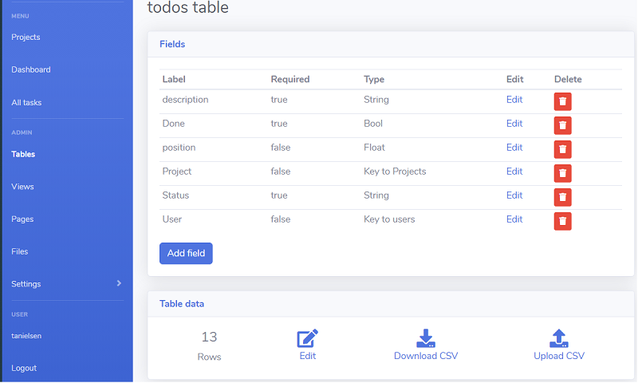

# Saltcorn CI/CD pipeline

Deploy Saltcorn with CI/CD on Elestio

 
 

# Once deployed ...

You can open Saltcorn UI here:

    URL: https://[CI_CD_DOMAIN]/admin
    email: [ADMIN_EMAIL]
    password: [ADMIN_PASSWORD]

You can open the pgAdmin web UI here:

    URL: https://[CI_CD_DOMAIN]:46911
    email: [ADMIN_EMAIL]
    password: [ADMIN_PASSWORD]

# Email Configuration

To configure your email sender, follow these steps:

1. Navigate to `https://[CI_CD_DOMAIN]/admin/email`
2. Set the SMTP host to `172.17.0.1`
3. Set the SMTP port to `25`
4. Enter the "Email from" address as `[DOMAIN]@vm.elestio.app`
5. Click on `Send test email` to verify the configuration
